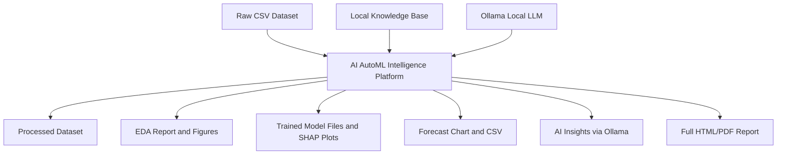
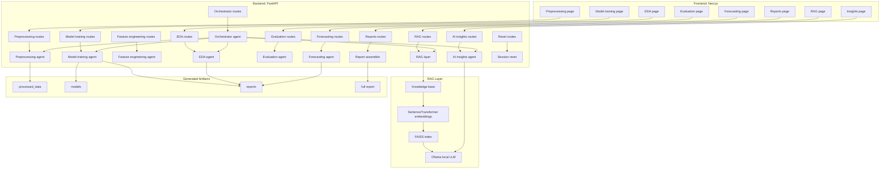
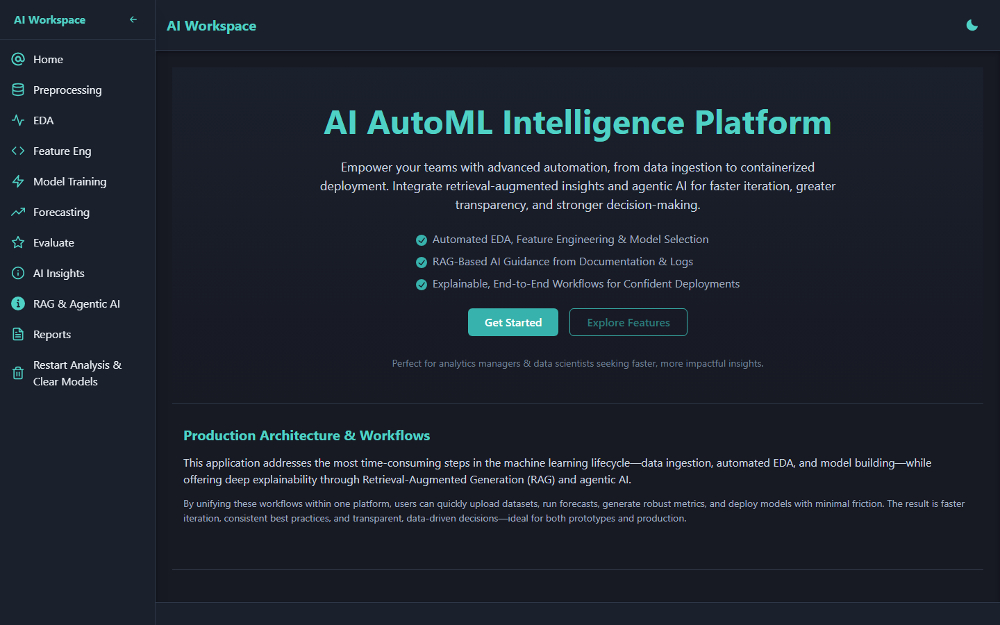
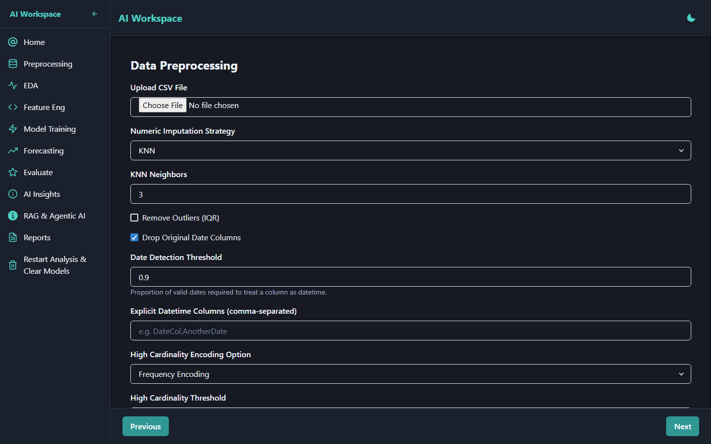
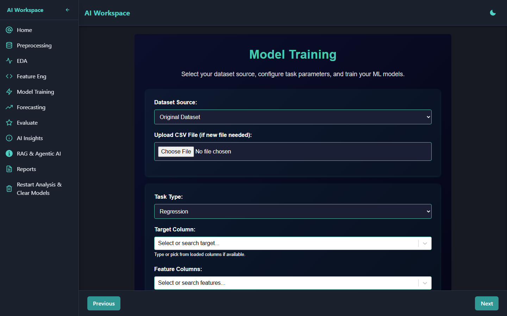
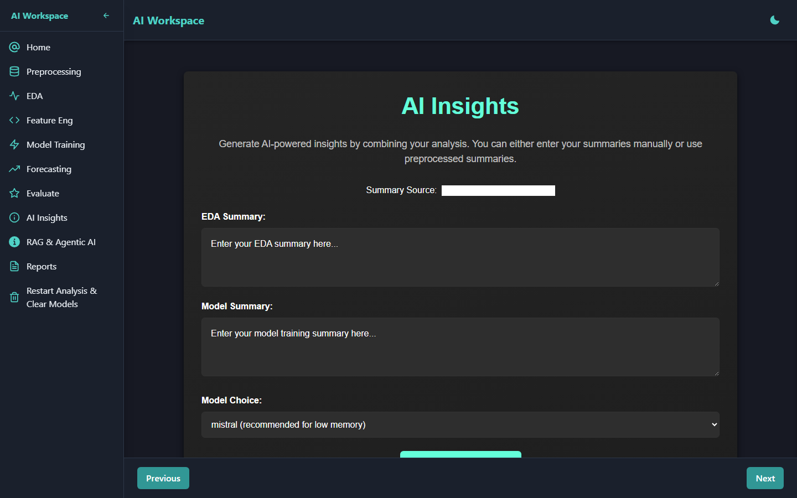
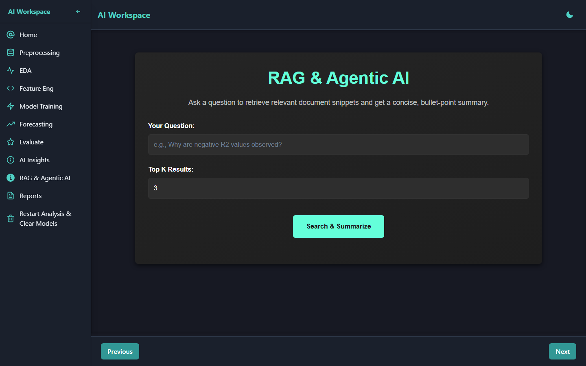
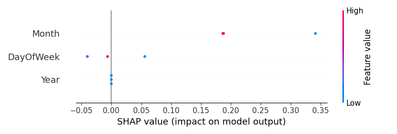
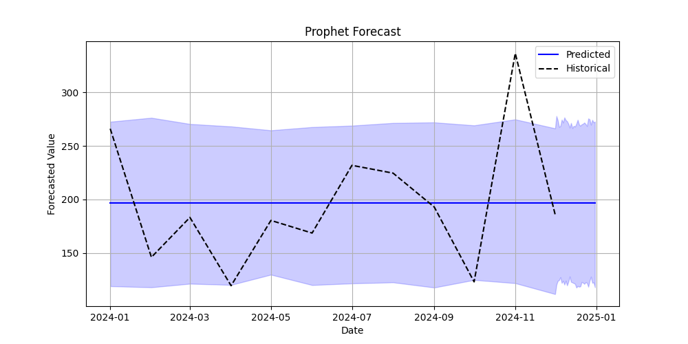

# AI AutoML Intelligence Platform

**FAISS RAG · Agentic AI · Full-Stack ML Automation**
FastAPI + Next.js · Python 3.12+ · Docker · Local Orchestration

A full-stack AutoML workflow platform for automated data preprocessing,
exploratory data analysis, feature engineering, multi-model training,
evaluation, time-series forecasting, RAG-assisted insight generation, and
report export. The system exposes each pipeline stage through a FastAPI
backend and a Next.js frontend, validated through API tests, Docker smoke
tests, visual walkthrough evidence, and stage-level benchmarks on synthetic
and public tabular datasets.

---

## Table of Contents

- [System Summary](#system-summary)
- [Quantitative Snapshot](#quantitative-snapshot)
- [Technology Stack](#technology-stack)
- [Business Problem](#business-problem)
- [System Objective](#system-objective)
- [System Value](#system-value)
- [Role in Workflow](#role-in-workflow)
- [Architecture](#architecture)
- [AutoML Workflow](#automl-workflow)
- [RAG and AI Insight Layer](#rag-and-ai-insight-layer)
- [Benchmark Evidence](#benchmark-evidence)
- [Testing Evidence](#testing-evidence)
- [Docker and Orchestration](#docker-and-orchestration)
- [Product Surfaces](#product-surfaces)
- [Screenshots and Visual Evidence](#screenshots-and-visual-evidence)
- [API Surface](#api-surface)
- [Operational Flow](#operational-flow)
- [Known System Constraints](#known-system-constraints)
- [Key Design Tradeoffs](#key-design-tradeoffs)
- [System Scope and Boundaries](#system-scope-and-boundaries)
- [Evidence Index](#evidence-index)
- [Repository Structure](#repository-structure)
- [Getting Started](#getting-started)
- [License](#license)
- [Author](#author)

---

## System Summary

The AI AutoML Intelligence Platform is a locally-orchestrated, full-stack
machine learning workflow system. It compresses the repeatable stages of an
ML project into a structured sequence of API-backed operations accessible
through a guided UI. A data analyst or ML practitioner uploads a CSV, steps
through preprocessing, EDA, feature engineering, model training, evaluation,
and forecasting, and exits with trained model files, SHAP explainability
plots, forecast charts, and a downloadable HTML/PDF report.

The platform is not a one-click black-box pipeline. Each stage is a
separately callable API route backed by a dedicated agent module. The user
controls which models to train, which metrics to optimize, and which
pipeline stages to run. This makes the workflow inspectable, reproducible,
and debuggable at each step.

A local RAG layer built on FAISS vector search and SentenceTransformer
embeddings supports document-grounded insight generation via Ollama, when
Ollama is running on the host. The orchestrator agent can coordinate
multiple pipeline stages when triggered, while individual stages remain
callable independently.

All quantitative claims in this document are traceable to benchmark logs,
test output files, and API introspection evidence generated during Phase
6B.3 of the project documentation audit.

---

## Quantitative Snapshot

| Dimension | Evidence |
|-----------|----------|
| Backend surface | 16 FastAPI routes across 11 route modules |
| Workflow engine | 8 specialist agent modules covering preprocessing, EDA, feature engineering, training, evaluation, forecasting, AI insights, and orchestration |
| Frontend surface | 10 Next.js product pages covering the full ML workflow |
| Test baseline | 57 passed, 3 skipped, 0 failed |
| Integration testing | 20 FastAPI TestClient integration tests added |
| Visual evidence | 15 screenshots and generated ML artifacts |
| Containerization | Backend and frontend Docker images smoke-tested with Docker Compose |
| RAG layer | FAISS vector search + SentenceTransformer embeddings + local Ollama generation |
| Benchmark coverage | Synthetic control benchmark + real public Telco Churn workflow benchmark |
| Real benchmark result | 231 ms preprocessing P50 and 818 ms LogisticRegression training P50 on the Telco workflow benchmark |
| Bottleneck identified | EDA visualization generation: 94,229 ms P50 due to pairplots, categorical countplots, and large figure serialization |

Benchmark datasets are used here as controlled validation inputs, not as the
primary measure of system scale. The main engineering evidence is the breadth
of the workflow surface, API coverage, test baseline, Docker orchestration,
visual evidence, and measured stage-level latency. Larger batch and
multi-dataset stress tests are a planned next scaling step.

> All latency figures are local in-process FastAPI TestClient measurements on
> a developer machine (Windows 11, Python 3.13.1). They reflect local workflow
> feasibility and relative stage cost, not deployment server throughput.

---

## Technology Stack

| Layer | Technology | Notes |
|-------|------------|-------|
| Data workflow | pandas, numpy, scikit-learn | Preprocessing, feature transforms, encoders, scalers |
| ML and evaluation | scikit-learn 1.6, XGBoost, statsmodels | Regression + classification; SHAP for explainability |
| Time-series forecasting | Prophet, ARIMA (statsmodels) | Prophet support is environment-sensitive; ARIMA available via statsmodels |
| RAG and AI insights | FAISS, SentenceTransformer (all-MiniLM-L6-v2), Ollama | Local retrieval and summarization; no external API required |
| Backend | FastAPI 0.110, Python 3.12+, uvicorn | 16 routes, 11 modules, async endpoints |
| Frontend | Next.js 15.2.1, Chakra UI, Recharts, React Select | 10 pages, browser-side API calls, no SSR data fetching |
| Testing | pytest 9.0.3, FastAPI TestClient | 57 passed, 3 skipped; unit + integration coverage |
| Benchmarking | Custom script (benchmark/run_benchmark.py) | N=5-10 per endpoint, JSON output |
| Containerization | Docker 29.3.0, Docker Compose v5.1.0 | Backend + frontend images, local orchestration |
| Evidence docs | Markdown, Playwright 1.60.0 | 15 screenshots, demo walkthrough, route inventory |

---

## Business Problem

Analysts and ML practitioners working with tabular datasets frequently
repeat the same manual steps: inspect a raw CSV, decide on imputation and
encoding strategies, run descriptive statistics, select candidate models,
compare metrics, explain predictions, and assemble a report for
stakeholders.

Each of these steps is tractable in isolation. The friction is in the
handoffs: data from preprocessing is not automatically available to EDA,
EDA output does not automatically feed feature engineering recommendations,
and model outputs require separate tooling to visualize and export. Scatter
across notebooks and scripts makes the workflow hard to reproduce,
hand off, or audit.

The platform addresses this by exposing each stage as a distinct,
independently callable API endpoint backed by a dedicated agent module.
State is passed between stages via UUID-based dataset references stored
in the browser session. The user can run the full pipeline in sequence
or call individual stages on-demand. All generated artifacts (processed
CSVs, model PKLs, SHAP plots, forecast charts, EDA reports, full HTML
reports) are written to predictable directories.

---

## System Objective

1. Automate repeatable ML workflow stages (preprocessing, EDA, feature
   engineering, model training, evaluation, forecasting, reporting) behind
   a consistent API surface.
2. Expose each stage through both a UI page and a REST API endpoint,
   making the workflow accessible to both direct API users and
   browser-based practitioners.
3. Support document-grounded insight generation through a local RAG layer
   (FAISS + SentenceTransformer + Ollama) without requiring external API
   keys.
4. Generate evidence artifacts at each stage: processed data files,
   trained model files, SHAP plots, EDA figures, forecast charts, and
   structured HTML/PDF reports.
5. Keep the entire workflow inspectable, benchmarked, and documented so
   that timing bottlenecks, API coverage gaps, and external dependencies
   are explicitly known.

---

## System Value

| Capability | Operational effect |
|------------|-------------------|
| Automated preprocessing | Removes manual imputation, encoding, and scaling decisions; writes processed dataset with stable UUID reference |
| EDA generation | Produces correlation heatmap, distribution plots, pairplot, and missing-value report without notebook setup |
| Feature engineering | Suggests polynomial features, interaction terms, and date decompositions via API call |
| Multi-model training | Trains user-selected regression or classification models in one API call; writes SHAP plots and PKL files |
| Model evaluation | Loads any session-scoped PKL model and evaluates on new data; returns per-metric breakdown |
| Time-series forecasting | Runs Prophet or ARIMA on a date-indexed CSV; outputs forecast CSV and chart |
| RAG-assisted insights | Retrieves semantically similar documents from FAISS index and summarizes with local Ollama LLM |
| Report generation | Assembles EDA results, training metrics, and forecasts into a single HTML/PDF report |
| Docker orchestration | Both services start from a single `docker compose up -d` with a Python-based backend healthcheck |
| Test and benchmark evidence | 57 tests validate pipeline correctness; benchmark JSON records per-endpoint P50/P95/P99 latency |

---

## Role in Workflow



The platform sits between a raw CSV input and a set of structured ML
artifacts. It does not require cloud credentials, a database, or an
external model registry. All outputs are written to local directories
and are accessible via API responses or direct file system access.

---

## Architecture



---

## AutoML Workflow

| Stage | UI Page | API Route | Agent Module | Output |
|-------|---------|-----------|-------------|--------|
| Preprocessing | `/preprocessing` | `POST /preprocessing/preprocess/` | `preprocessing_agent` | UUID-keyed CSV in `processed_data/` and `original_data/` |
| EDA | `/eda` | `POST /eda/analysis/` | `eda_agent` | EDA report JSON, figures in `reports/figures/` |
| Feature engineering | `/feature-engineering` | `POST /feature-engineering/advanced/` | `feature_engineering_agent` | Feature suggestion text; optional transformed dataset |
| Column inspection | `/feature-engineering` | `GET /feature-engineering/columns/` | `feature_engineering_agent` | Column names, types, missing counts |
| Model training | `/model-training` | `POST /model-training/train/` | `model_training_agent` | PKL model files, SHAP plots, training CSV in `reports/` |
| Evaluation | `/evaluate` | `POST /evaluation/evaluate/` | `evaluation_agent` | Per-metric evaluation report |
| Model listing | `/evaluate` | `GET /evaluation/list-models/` | `evaluation_agent` | List of PKL/joblib filenames in session folder |
| Forecasting | `/forecasting` | `POST /forecasting/forecast/` | `forecasting_agent` | Forecast CSV, forecast plot PNG in `reports/` |
| AI insights | `/insights` | `POST /ai-insights/generate/` | `ai_insights_agent` | LLM-generated narrative insights (requires Ollama) |
| RAG query | `/rag` | `POST /rag/query-summarize` | RAG layer + Ollama | Answer with retrieved context (requires Ollama) |
| Orchestration | (internal) | `POST /orchestrator/orchestrate` | `orchestrator_agent` | Chains EDA, training, RAG, insights in sequence |
| Report generation | `/reports` | `POST /reports/generate-full` | report assembler | `reports/full_report.html` |
| Report download | `/reports` | `GET /reports/download-full` | report assembler | `reports/full_report.pdf` (requires system Chrome) |
| Session reset | (utility) | `POST /reset/restart-analysis` | session manager | New session UUID; clears `models/` directory |

---

## RAG and AI Insight Layer

The platform includes a local retrieval-augmented generation layer built
without LangChain or a managed vector database. The implementation uses
three components:

**1. FAISS index (`data_1/` directory)**
A pre-built FAISS flat-L2 index over document embeddings. The index is
loaded at application import time and held in memory. The `/rag/query-summarize`
endpoint accepts a free-text query, encodes it using SentenceTransformer,
performs a nearest-neighbor search over the FAISS index, retrieves the
top-K most similar document chunks, and passes the retrieved context to
Ollama for summarization.

**2. SentenceTransformer (all-MiniLM-L6-v2)**
Encodes both the query and the indexed documents into 384-dimensional dense
vectors. The model runs locally; no API key is required.

**3. Ollama (local LLM server)**
Handles the generation step. Supported models: `mistral`, `gemma2`,
`llama3.3`. Ollama must be running on the host at `http://localhost:11434`.
In Docker Compose, the backend reaches Ollama via
`http://host.docker.internal:11434`. Without a running Ollama instance,
the `/ai-insights/generate/` and `/rag/query-summarize` routes return an
error. All other pipeline stages operate independently of Ollama.

**Dependency summary:**

| Component | Status | Required for |
|-----------|--------|-------------|
| FAISS index | Included (`data_1/`) | `/rag/query-summarize`, `/orchestrator/orchestrate` |
| SentenceTransformer | Installed | Same as above |
| Ollama | Separate host process | AI insights and RAG query generation |

---

## Benchmark Evidence

All latency figures are local in-process FastAPI TestClient measurements.
No network stack is involved. These figures reflect local workflow
feasibility and relative stage cost on a developer machine. They are not
deployment server latencies.

**Environment:** Windows 11 Home 10.0.26200, Python 3.13.1, pytest 9.0.3

### A: Synthetic benchmark (200 rows, 6 columns, N=10)

| Endpoint | P50 (ms) | P95 (ms) | P99 (ms) | Success |
|----------|----------|----------|----------|---------|
| GET / | 0.7 | 1.4 | 1.7 | 10/10 |
| POST /preprocessing/preprocess/ | 12.5 | 20.9 | 24.6 | 10/10 |
| POST /eda/analysis/ | 3,696.8 | 4,546.9 | 4,863.2 | 10/10 |
| POST /model-training/train/ (LinearRegression) | 6.4 | 14.9 | 20.2 | 10/10 |
| POST /reports/generate-full | 1.7 | 2.2 | 2.6 | 10/10 |
| GET /evaluation/list-models/ | 0.8 | 0.9 | 1.0 | 10/10 |
| POST /ai-insights/generate/ (Ollama mocked) | 1.6 | 3.9 | 5.0 | 10/10 |
| POST /reset/restart-analysis (rmtree mocked) | 1.3 | 1.5 | 1.5 | 10/10 |

### B: Real dataset benchmark (Telco Customer Churn, 7,043 rows, 21 columns)

| Endpoint | N | P50 (ms) | P95 (ms) | P99 (ms) | Success |
|----------|---|----------|----------|----------|---------|
| POST /preprocessing/preprocess/ | 5 | 231.1 | 240.7 | 242.3 | 5/5 |
| POST /eda/analysis/ (max_numeric_cols=3) | 3 | 94,229.1 | 159,390.5 | 165,182.6 | 3/3 |
| POST /model-training/train/ (LogisticRegression) | 3 | 818.3 | 867.6 | 872.0 | 3/3 |

### Scalability observations

| Stage | 200 rows P50 | 7,043 rows P50 | Row scale factor | Latency ratio |
|-------|-------------|----------------|-----------------|---------------|
| Preprocessing | 12.5 ms | 231.1 ms | 35x | 18.5x |
| EDA | 3,697 ms | 94,229 ms | 35x | 25.5x |
| Model training | 6.4 ms | 818.3 ms | 35x | 128x |

**Interpretation:**

- Preprocessing scales sub-linearly (18.5x for 35x rows). KNN imputation is
  O(n) and categorical encoding overhead grows with column count, not row
  count.
- EDA is the dominant pipeline bottleneck at scale. The 94-second P50 for
  7,043 rows includes matplotlib figure generation for 18 categorical
  countplots (one per categorical column), 3 numeric distribution plots,
  a seaborn pairplot, and large JSON serialization of all figures in the
  HTTP response. The EDA agent was not designed for low-latency use; it
  is a report generation step.
- Model training scales super-linearly (128x) because LogisticRegression
  involves matrix operations scaling with n_samples x n_features, and
  one-hot encoding expanded the Telco feature space from 21 to
  approximately 43 binary features. The 818 ms P50 still represents a
  sub-second training run for this dataset and model.

Full benchmark JSON: [`benchmark/benchmark_results.json`](benchmark/benchmark_results.json)
Detailed report: [`docs/evidence/benchmark_report.md`](docs/evidence/benchmark_report.md)

---

## Testing Evidence

```
57 passed, 3 skipped, 0 failed
```

The test suite covers core agent behavior and API integration paths
across preprocessing, EDA, model training, evaluation, orchestration,
and backend route behavior. Phase 6B.3B added 20 FastAPI TestClient
integration tests.

| Category | Files | Coverage focus |
|----------|-------|---------------|
| Agent unit tests | `test_eda_agent.py`, `test_model_training_agent.py`, `test_preprocessing_agent.py`, `test_orchestrator_agent.py` | Agent logic, data transformations, error handling |
| API integration tests | `test_api_health.py`, `test_api_preprocessing.py`, `test_api_eda.py`, `test_api_model_training.py` | HTTP status codes, response keys, error cases |
| 3 skipped | Legacy or intentionally excluded tests | Two AI-insight prompt-template expectations and one removed helper-function test are skipped and documented in `docs/evidence/test_run_output.txt`. |

**Integration test coverage by endpoint:**

| Endpoint | Tests | What is verified |
|----------|-------|-----------------|
| `GET /` | 3 | HTTP 200, message key present, content type |
| `POST /preprocessing/preprocess/` | 4 | Valid CSV returns 200, response shape, no-file returns 422 |
| `POST /eda/analysis/` | 5 | Valid CSV returns 200, report keys present, no-input error, bad dataset_id |
| `POST /model-training/train/` | 5 | LinearRegression 200, metric keys, missing-model error, missing-file error |
| `GET /evaluation/list-models/` | 2 | 200, `models` key is a list |
| `POST /reset/restart-analysis` | 1 | 200, `session_id` returned, rmtree mocked |

Endpoints not covered by integration tests (external service dependencies
or file-system state requirements) are covered by agent-level unit tests.

---

## Docker and Orchestration

Both the backend and frontend are packaged as Linux containers and
orchestrated via Docker Compose. The full stack starts with a single
command.

**Images built and smoke-tested locally:**

| Image | Tag | Size | Created |
|-------|-----|------|---------|
| `automl-backend` | `local` | 17.6 GB | 2026-05-23 |
| `automl-frontend` | `local` | 3.88 GB | 2026-05-23 |

The backend image includes the full ML stack: PyTorch 2.6.0, CUDA runtime
libraries, sentence-transformers, Prophet, scikit-learn, XGBoost,
and all 183 dependencies from `requirements.txt` (with `pywin32` filtered,
as it is a Windows-only package).

**Dockerfile highlights:**

| File | Base image | Key steps |
|------|-----------|-----------|
| `Dockerfile` (backend) | `python:3.12-slim` | Filter pywin32, pip install 183 packages, uvicorn CMD |
| `frontend/Dockerfile` | `node:20-slim` | npm ci, next build (production bundle), next start CMD |

**docker-compose.yml:**

- Backend: port 8000, Python-based healthcheck, `restart: unless-stopped`
- Frontend: port 3000, `depends_on: backend: condition: service_healthy`
- Ollama: `OLLAMA_HOST=http://host.docker.internal:11434` (not containerized)

**Smoke test results (local, 2026-05-23):**

```
docker compose ps
NAME              IMAGE                   STATUS                    PORTS
automl-backend    automl-backend:local    Up (healthy)   0.0.0.0:8000->8000/tcp
automl-frontend   automl-frontend:local   Up             0.0.0.0:3000->3000/tcp

GET http://localhost:8000/
{"message":"AI AutoML Backend is running. This is the RAG + Agentic AI pipeline."}

GET http://localhost:3000/
HTTP 200 - 62,166 bytes (Next.js HTML)
```

The image size is acceptable for local evidence and demonstration, but
future deployment work should split heavyweight ML/RAG dependencies or
use slimmer runtime profiles.

Full evidence: [`docs/evidence/docker_smoke_test.md`](docs/evidence/docker_smoke_test.md)

---

## Product Surfaces

The platform ships 10 frontend pages covering the full pipeline:

| Page | Route | Function |
|------|-------|---------|
| Homepage | `/` | Platform overview, pipeline navigation cards, sample metric charts |
| Preprocessing | `/preprocessing` | CSV upload, imputation/encoding/scaling configuration |
| EDA | `/eda` | Exploratory analysis with statistics and figure generation |
| Feature Engineering | `/feature-engineering` | Automated feature suggestion pipeline |
| Model Training | `/model-training` | Multi-model selector, metric selector, training execution |
| Evaluation | `/evaluate` | Load saved model, evaluate on new data, view metrics |
| Forecasting | `/forecasting` | Prophet/ARIMA model selection, forecast period configuration |
| AI Insights | `/insights` | LLM-generated narrative insights via Ollama (requires Ollama) |
| RAG Query | `/rag` | Free-text query over FAISS-indexed knowledge base via Ollama |
| Reports | `/reports` | Assemble and download full pipeline report as HTML/PDF |

---

## Screenshots and Visual Evidence

All screenshots were captured using Playwright headless Chromium 1.60.0
against the live Docker Compose stack (viewport 1440x900, networkidle
strategy) on 2026-05-23.

**Platform Homepage**



*Navigation cards, pipeline overview, and sample training metric charts.*

**Preprocessing Page**



*CSV upload control with imputation, encoding, and scaling configuration.*

**Model Training Page**



*Multi-model selector, metric selection, and training execution interface.*

**AI Insights Page**



*Ollama-powered insight generation from EDA and training summaries.*

**RAG Query Interface**



*Free-text query input with top-K retrieval configuration.*

**SHAP Explainability Artifact (Random Forest)**



*SHAP beeswarm summary plot generated by the model training pipeline on
a retail sales dataset.*

**Prophet Forecast Artifact**



*Prophet 30-period sales forecast chart generated by the forecasting pipeline.*

Full screenshot inventory: [`docs/evidence/visual_evidence_inventory.md`](docs/evidence/visual_evidence_inventory.md)

---

## API Surface

All 16 routes are registered and discoverable at `http://localhost:8000/docs`
via FastAPI's built-in OpenAPI interface.

| # | Method | Path | Purpose | Test coverage | External dependency |
|---|--------|------|---------|---------------|---------------------|
| 1 | GET | `/` | Health check and service identity | Yes (3 tests) | None |
| 2 | POST | `/preprocessing/preprocess/` | Ingest and preprocess a CSV | Yes (4 tests) | None |
| 3 | POST | `/eda/analysis/` | Exploratory data analysis | Yes (5 tests) | None |
| 4 | POST | `/feature-engineering/advanced/` | Advanced feature transformation | Agent unit tests | None |
| 5 | GET | `/feature-engineering/columns/` | Column metadata inspection | None | None |
| 6 | POST | `/model-training/train/` | Train and evaluate ML models | Yes (5 tests) | None |
| 7 | POST | `/forecasting/forecast/` | Time-series forecasting | Skipped | Prophet (environment-sensitive) |
| 8 | GET | `/evaluation/list-models/` | List saved models in session | Yes (2 tests) | None |
| 9 | POST | `/evaluation/evaluate/` | Evaluate saved model on new data | Agent unit tests | Pre-saved PKL |
| 10 | POST | `/ai-insights/generate/` | LLM narrative insights | Skipped (Ollama) | Ollama local |
| 11 | POST | `/rag/query-summarize` | FAISS retrieval + Ollama answer | Skipped (Ollama) | FAISS + Ollama |
| 12 | POST | `/orchestrator/orchestrate` | Agentic multi-stage chain | Agent unit tests | FAISS + Ollama |
| 13 | POST | `/reports/generate-full` | Assemble full HTML report | None | None |
| 14 | GET | `/reports/view-full` | Serve full HTML report inline | None | None |
| 15 | GET | `/reports/download-full` | Convert HTML report to PDF | None | System Chrome |
| 16 | POST | `/reset/restart-analysis` | Clear models, new session UUID | Yes, mocked (1 test) | None |

Full inventory: [`docs/evidence/api_route_inventory.md`](docs/evidence/api_route_inventory.md)

---

## Operational Flow

**1. Start services**

```bash
docker compose up -d
docker compose ps   # wait for automl-backend (healthy)
```

**2. Upload and preprocess a dataset**

Navigate to `http://localhost:3000/preprocessing`. Upload a CSV file.
Configure imputation (KNN, mean, median), outlier removal, encoding, and
scaling. Submit. The API response includes a `dataset_id` UUID stored in
browser `localStorage` for downstream stages.

**3. Generate EDA**

Navigate to `/eda`. The page reads the stored `dataset_id` and calls
`POST /eda/analysis/`. Correlation heatmap, distribution plots, and pairplot
are returned in the response and displayed inline. Generated figures are
also written to `reports/figures/`.

**4. Apply feature engineering**

Navigate to `/feature-engineering`. The agent returns automated feature
suggestions (polynomial features, interaction terms, date decompositions).
An optional save step writes the transformed dataset to
`feature_engineered_data/`.

**5. Train candidate models**

Navigate to `/model-training`. Select task type (regression or
classification), models (from the 10 available sklearn/XGBoost estimators),
evaluation metric, and test split ratio. The training agent trains all
selected models in one call, writes PKL files to `models/`, and returns
per-model metric scores. SHAP summary plots are saved to `reports/`.

**6. Evaluate outputs**

Navigate to `/evaluate`. The endpoint loads the trained model and evaluates
it against an uploaded or preprocessed dataset. Per-metric evaluation
results are returned.

**7. Run forecasting (if time-series data is available)**

Navigate to `/forecasting`. Select Prophet or ARIMA, set the target column
and forecast period. The agent returns a forecast CSV and saves a forecast
chart to `reports/`. Prophet availability depends on the Python environment; validate before
use. ARIMA is available via statsmodels as an alternative.

**8. Generate AI insights and RAG answers (if Ollama is running)**

Navigate to `/insights` or `/rag`. These stages require Ollama running on
the host at `localhost:11434`. Without Ollama, the routes return an error.
With Ollama, the AI insights agent generates narrative data science
commentary; the RAG endpoint retrieves semantically similar knowledge base
documents and generates a grounded answer.

**9. Export reports**

Navigate to `/reports`. The assembly endpoint scans `reports/` for pipeline
artifacts matching the current session and writes `full_report.html`.
A PDF version is available via `GET /reports/download-full` if Chrome is
installed at the expected system path.

---

## Known System Constraints

| Constraint | Detail |
|------------|--------|
| Benchmark is local in-process only | All latencies were measured via FastAPI TestClient with no network stack; not representative of deployment server throughput |
| EDA is visualization-heavy | P50 of 94 seconds on 7,043 rows is dominated by matplotlib figure generation (18 countplots + pairplot) and large JSON serialization in the response; the route is a report generation step, not a low-latency query |
| Ollama must run separately | AI insights and RAG routes require Ollama on the host; Docker Compose reaches it via `host.docker.internal:11434`; without it, those two endpoints return errors |
| Prophet support is environment-sensitive | The forecasting route is implemented, but Prophet dependency resolution can vary by Python version and environment. ARIMA remains available through statsmodels, while Prophet usage should be validated in the target runtime. |
| PDF download requires system Chrome | `GET /reports/download-full` requires Chrome at a hardcoded Windows path; Linux containers do not have Chrome by default |
| No authentication | There is no login system; the platform is suited for local and demo use |
| Session state in localStorage | Pipeline state (`dataset_id`, `session_id`) is stored in browser `localStorage`; clearing storage resets pipeline continuity |
| Large Docker images | The backend image is 17.6 GB due to PyTorch, CUDA runtime, and the full ML dependency stack; initial build is time-intensive |
| No persistent Docker volume | Uploaded data and generated reports are not persisted across `docker compose down` without an explicit volume mount |
| 3 tests skipped | Two AI-insight prompt-template expectations and one removed helper-function test are skipped; skips are expected and documented in `docs/evidence/test_run_output.txt` |

---

## Key Design Tradeoffs

| Decision | Alternative considered | Rationale |
|----------|----------------------|-----------|
| UI-guided pipeline stages vs fully autonomous AutoML | One-click pipeline execution with no user control | Explicit stage control keeps the workflow inspectable, debuggable, and adaptable to different dataset types without redesign |
| Local Ollama vs hosted LLM API | OpenAI or Groq API for insights and RAG | No API key required; no data leaves the local machine; model choice is flexible (mistral, gemma2, llama3.3) |
| FAISS local index vs managed vector database | Pinecone, Weaviate, or cloud-hosted vector search | Zero infrastructure cost; index loads from a local directory; no network dependency for retrieval |
| Report-rich EDA vs low-latency EDA | Lightweight stats-only response | The EDA agent generates full matplotlib artifacts suitable for stakeholder reports; latency is accepted as a tradeoff for output quality |
| Docker local orchestration vs cloud deployment | AWS, GCP, or Azure hosted service | Eliminates cloud cost and credential requirements for portfolio demonstration; Docker ensures reproducibility on any machine with the daemon installed |
| Multi-model training in one API call vs sequential calls | Separate API call per model | Reduces UI round-trips and simplifies state management for the browser session |

---

## System Scope and Boundaries

**In scope:**

- Local full-stack AutoML workflow with FastAPI backend and Next.js frontend
- REST API surface with 16 routes across 11 modules
- 8 agent modules for pipeline stage execution
- Unit and integration test coverage (57 passed, 3 skipped, 0 failed)
- Local in-process benchmark evidence (synthetic + real Telco dataset)
- Docker Compose local orchestration with smoke-tested images
- Local RAG layer (FAISS + SentenceTransformer + Ollama)
- Generated evidence artifacts: SHAP plots, forecast charts, EDA reports, full HTML/PDF reports
- 15 visual evidence screenshots

**Out of scope:**

- Production SaaS deployment or cloud hosting
- Authenticated multi-user platform
- Guaranteed model quality or performance on arbitrary datasets
- Active CI/CD pipeline or automated release process
- Customer usage evidence
- Distributed or streaming data processing
- Real-time inference serving

---

## Evidence Index

| Document | Description |
|----------|-------------|
| [`docs/evidence/automl_system_audit_report.md`](docs/evidence/automl_system_audit_report.md) | Full system audit: stack, routes, agents, constraints, upgrade plan |
| [`docs/evidence/automl_l2_engineering_upgrade_plan.md`](docs/evidence/automl_l2_engineering_upgrade_plan.md) | L2 engineering upgrade priorities and design directions |
| [`docs/evidence/data_safety_review.md`](docs/evidence/data_safety_review.md) | Data handling, secrets scan, .gitignore review |
| [`docs/evidence/api_route_inventory.md`](docs/evidence/api_route_inventory.md) | All 16 routes, test coverage, external dependency map |
| [`docs/evidence/benchmark_report.md`](docs/evidence/benchmark_report.md) | Benchmark methodology, results, and scalability interpretation |
| [`docs/evidence/docker_smoke_test.md`](docs/evidence/docker_smoke_test.md) | Docker build logs, smoke test results, compose ps output |
| [`docs/evidence/visual_evidence_inventory.md`](docs/evidence/visual_evidence_inventory.md) | Per-screenshot metadata, README-ready flags |
| [`docs/DEMO_WALKTHROUGH.md`](docs/DEMO_WALKTHROUGH.md) | Step-by-step local demo walkthrough, all 10 pipeline stages |
| [`docs/SCREENSHOT_GUIDE.md`](docs/SCREENSHOT_GUIDE.md) | How to refresh screenshots, Playwright setup, naming convention |
| [`benchmark/benchmark_results.json`](benchmark/benchmark_results.json) | Raw benchmark JSON with per-endpoint P50/P95/P99 |

---

## Repository Structure

```
AutoML_AI_Platform/
├── backend/
│   └── app/
│       ├── agents/               # 8 agent modules
│       │   ├── preprocessing_agent.py
│       │   ├── eda_agent.py
│       │   ├── feature_engineering_agent.py
│       │   ├── model_training_agent.py
│       │   ├── evaluation_agent.py
│       │   ├── forecasting_agent.py
│       │   ├── ai_insights_agent.py
│       │   └── orchestrator_agent.py
│       ├── api/                  # 11 route modules (12 files including __init__)
│       │   ├── preprocessing_routes.py
│       │   ├── eda_routes.py
│       │   ├── feature_engineering_routes.py
│       │   ├── model_training_routes.py
│       │   ├── evaluation_routes.py
│       │   ├── forecasting_routes.py
│       │   ├── ai_insights_routes.py
│       │   ├── rag_routes.py
│       │   ├── orchestrator_routes.py
│       │   ├── reports_routes.py
│       │   └── reset_routes.py
│       └── main.py               # FastAPI app, route registration
├── frontend/
│   ├── pages/                    # 10 Next.js pages
│   ├── components/               # Reusable React components
│   ├── lib/api.js                # Axios instance (baseURL: http://127.0.0.1:8000)
│   ├── styles/
│   └── Dockerfile                # Node 20 slim, npm ci, next build
├── tests/                        # pytest suite (57 passed, 3 skipped)
├── benchmark/
│   ├── run_benchmark.py          # Benchmark script
│   └── benchmark_results.json   # Raw results
├── docs/
│   ├── DEMO_WALKTHROUGH.md
│   ├── SCREENSHOT_GUIDE.md
│   └── evidence/
│       ├── screenshots/          # 15 PNG files
│       ├── api_route_inventory.md
│       ├── benchmark_report.md
│       ├── docker_smoke_test.md
│       └── visual_evidence_inventory.md
├── scripts/
│   └── capture_screenshots.js   # Playwright screenshot capture
├── data_1/                       # FAISS knowledge base index
├── models/                       # Trained PKL model files
├── reports/                      # Generated EDA, SHAP, forecast plots + reports
├── processed_data/               # UUID-keyed preprocessed CSVs
├── original_data/                # UUID-keyed original uploaded CSVs
├── Dockerfile                    # Python 3.12-slim backend
├── docker-compose.yml            # Backend + frontend orchestration
├── .env.example                  # Environment variable template
├── requirements.txt              # Python dependencies (183 packages)
└── README.md
```

---

## Getting Started

### Prerequisites

- Python 3.12+ (tested on 3.12 and 3.13)
- Node.js 20+
- Docker 29.3.0+ and Docker Compose v5.1.0+ (for containerized startup)
- Ollama (optional, for AI insights and RAG query endpoints only)

### Option A: Docker Compose (recommended)

```bash
# From the project root
docker compose up -d

# Verify both services are running
docker compose ps
# automl-backend should show (healthy)

# Open the frontend
# http://localhost:3000

# View API docs
# http://localhost:8000/docs

# Stop services
docker compose down
```

### Option B: Local Python + Node.js

```bash
# 1. Python environment
python -m venv venv
venv\Scripts\activate          # Windows
# source venv/bin/activate     # macOS/Linux

pip install -r requirements.txt

# 2. Backend
uvicorn backend.app.main:app --host 0.0.0.0 --port 8000 --reload

# 3. Frontend (separate terminal)
cd frontend
npm install
npm run dev
# Open http://localhost:3000
```

### Environment variables

Copy `.env.example` to `.env` and adjust if needed:

```bash
cp .env.example .env
```

Default values work for local development. The only variable that requires
action is `OLLAMA_HOST` if you want AI insights and RAG endpoints to work:

```
OLLAMA_HOST=http://localhost:11434
OLLAMA_MODEL=mistral
```

### Run tests

```bash
python -m pytest tests/ -v --tb=short
# Expected: 57 passed, 3 skipped, 0 failed
```

### Run benchmarks

```bash
python benchmark/run_benchmark.py
# Results written to benchmark/benchmark_results.json
```

### Install Ollama (optional)

Download from [https://ollama.com](https://ollama.com) and run:

```bash
ollama pull mistral
ollama serve
```

Once running, the `/ai-insights/generate/` and `/rag/query-summarize`
endpoints become operational.

---

## License

This project is not open source. All rights are reserved by the author.

Personal and educational usage is permitted. Commercial usage,
redistribution, or derivative work requires explicit written permission
from the author. Contact via
[LinkedIn](https://linkedin.com/in/ijazkakkod) for collaboration or
licensing queries.

---

## Author

**Ijaz Kakkod**

Machine Learning Systems | AutoML Workflows | Agentic AI | RAG Systems | Model Governance

[](https://linkedin.com/in/ijazkakkod)
[](https://github.com/IjazKakkodDS)
